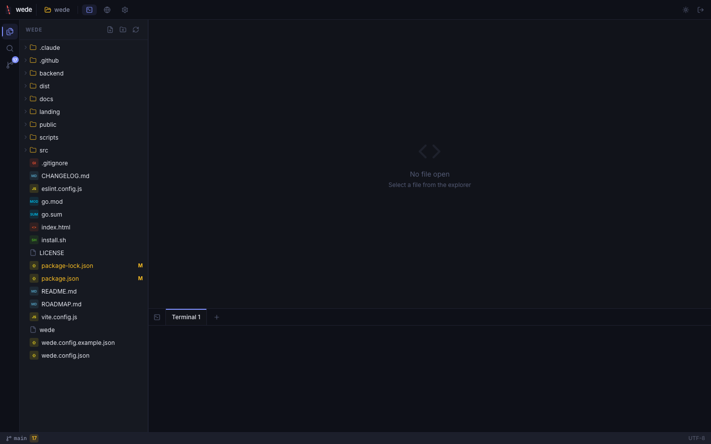
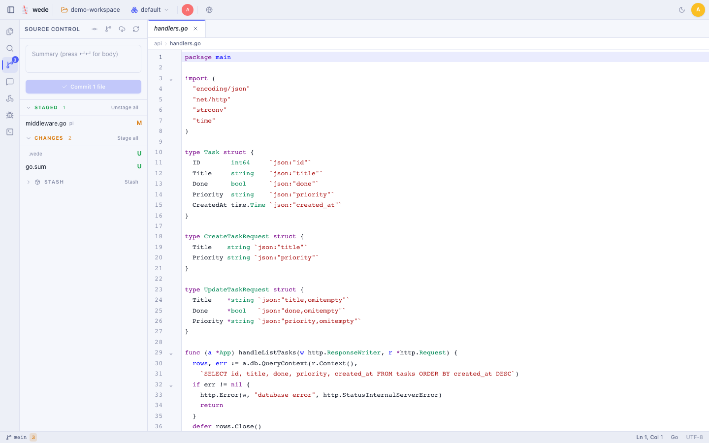
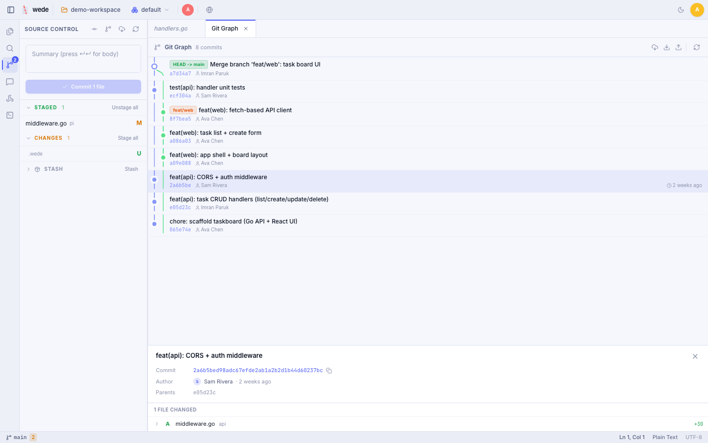
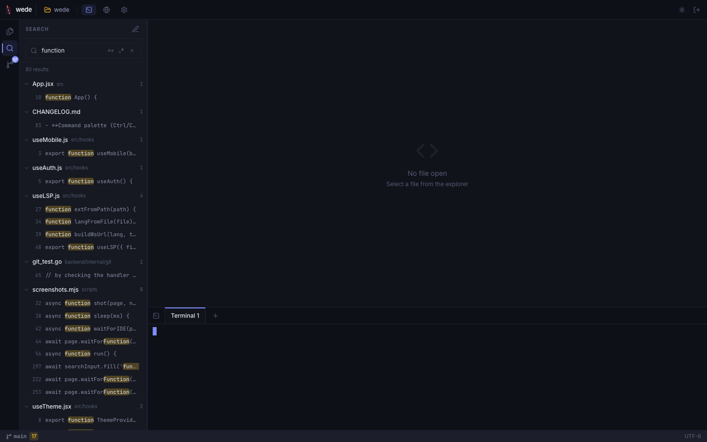
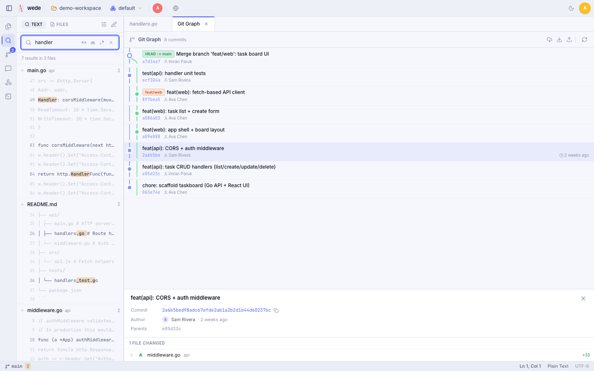
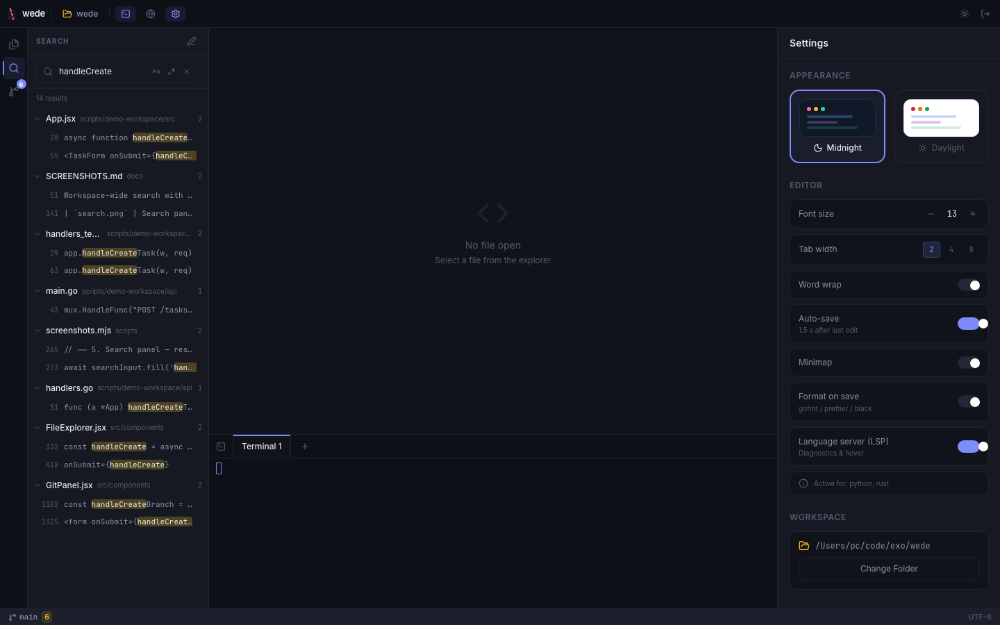
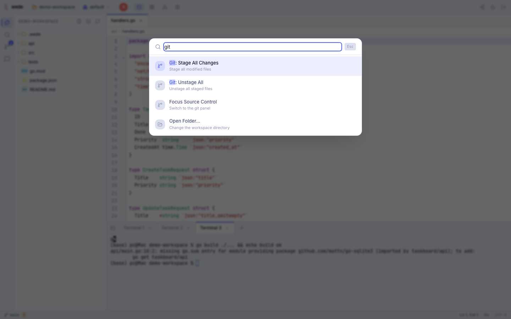

<div align="center">


# wede

**A lightweight, open-source, self-hosted web IDE.**<br>
**Code editor, terminal, git, and file explorer — all in your browser.**

[](LICENSE)
[](https://github.com/vul-os/wede/releases)
[](https://github.com/vul-os/wede/actions)
[](https://golang.org)
[](https://react.dev)

*Vulos — rooted in **vula**, the Zulu and Xhosa word for **open**.*

<sub>Part of the <strong><a href="https://vulos.org">Vulos</a></strong> OS suite &nbsp;</sub>



</div>

---

## Overview

wede is a single ~10 MB Go binary that serves a full web IDE straight from your machine. No cloud dependency, no Docker, no subscriptions, no database. Deploy it on a server, a NAS, a Raspberry Pi, or just run it locally — then code from any device through your browser.

It runs standalone or embedded as a first-class app in the [Vulos OS](https://vulos.org) shell via `frame_ancestors` iframe integration.

[Website](https://wede.vulos.org/) · [Quick start](#quick-start) · [Docs](#documentation) · [Changelog](CHANGELOG.md) · [Roadmap](ROADMAP.md)

---

## Screenshots

<table>
<tr>
<td><br><em>IDE main view — editor + file tree</em></td>
<td><br><em>Git panel — staging with inline diff</em></td>
</tr>
<tr>
<td><br><em>Git commit graph (SVG DAG)</em></td>
<td><br><em>Full PTY terminal</em></td>
</tr>
<tr>
<td><br><em>Workspace search + replace</em></td>
<td><br><em>Settings — editor, LSP, themes</em></td>
</tr>
<tr>
<td><br><em>Command palette (Ctrl+Shift+P)</em></td>
<td><br><em>Built-in browser preview</em></td>
</tr>
</table>

See [docs/SCREENSHOTS.md](docs/SCREENSHOTS.md) for the full gallery and how to regenerate.

---

## Features

| Feature | Description |
|---------|-------------|
| **File Explorer** | VS Code-style project tree with git status colours. Context menu: copy, paste (recursive), rename, delete with confirmation. File-watching via SSE auto-refreshes on disk changes. |
| **Code Editor** | CodeMirror 6 with syntax highlighting for JavaScript, TypeScript, Go, Python, Rust, and 10+ languages. Multi-cursor (Alt+Click), column select (Alt+Drag), bracket matching, code folding. |
| **Auto-save** | 1.5 s debounced save after each edit. Status indicator in the top bar. Toggle per-session in Settings. Manual Ctrl/Cmd+S always works. |
| **Project Search** | Ctrl/Cmd+Shift+F — workspace-wide search with ripgrep (Go walker fallback). Case and regex toggles. Replace across files. Results grouped by file; click to jump to exact line. |
| **Command Palette** | Ctrl/Cmd+Shift+P — fuzzy-search over all IDE commands: save, new file/folder, toggle terminal, git ops, theme switch, logout, and more. |
| **Web Terminal** | Full PTY terminal emulator via xterm.js and WebSocket. Multiple tabs. Run shell commands, SSH, Docker — anything. |
| **Git Client** | Visual commit graph (SVG DAG), staging area, per-hunk staging, branch management, git push/pull/fetch, create branch, stash, merge-conflict resolution. |
| **Built-in Browser** | Preview your running web app in an embedded browser tab without leaving the IDE. |
| **LSP** | Language Server Protocol proxy for diagnostics, hover, completion, and go-to-definition. Supports gopls, typescript-language-server, pylsp, rust-analyzer. |
| **Format on Save** | Auto-formats on Ctrl/Cmd+S: `gofmt` for Go, `prettier` for JS/TS/CSS/JSON/HTML/Markdown, `black` for Python. |
| **Image & Binary Preview** | Images render inline with a checkerboard background; other binary files show a size notice instead of garbled editor content. |
| **Editor Settings** | Font size, tab width, word wrap, minimap, auto-save — all live-applied without reopening files, persisted to `localStorage`. |
| **Dark & Light Themes** | Midnight (dark) and Daylight (light) colour schemes with Space Grotesk / Inter / JetBrains Mono font stack. |
| **Mobile Friendly** | Fully responsive UI for tablets and phones. |
| **Secure Access** | Password authentication with 3-attempt lockout (persisted across restarts). Session TTL, server-side logout, WS token in subprotocol (not URL). |
| **Single binary** | Go embeds the entire frontend — one ~10 MB file to deploy anywhere. |

---

## Quick start

```bash
curl -fsSL https://raw.githubusercontent.com/vul-os/wede/main/install.sh | bash
```

The installer downloads the binary, generates a random password, and prints it. Then:

```bash
wede /path/to/your/project
```

Open [http://localhost:9090](http://localhost:9090) and log in.

Or download a binary directly from [GitHub Releases](https://github.com/vul-os/wede/releases).

**Manual config** — save as `wede.config.json` in your project root (gitignored by default):

```json
{
  "password": "your-strong-password-here",
  "port": "9090"
}
```

---

## Documentation

| Document | Description |
|----------|-------------|
| [docs/GETTING-STARTED.md](docs/GETTING-STARTED.md) | Installation, first steps, network exposure |
| [docs/ARCHITECTURE.md](docs/ARCHITECTURE.md) | Internal structure, API surface, security model |
| [docs/CONFIGURATION.md](docs/CONFIGURATION.md) | All config keys, iframe embedding, CLI flags |
| [docs/SCREENSHOTS.md](docs/SCREENSHOTS.md) | Screenshot gallery + how to regenerate |
| [ROADMAP.md](ROADMAP.md) | Planned features by milestone |
| [CHANGELOG.md](CHANGELOG.md) | Full version history |

---

## Development

**Prerequisites:** Go 1.25+, Node.js 18+

**Frontend** (React + Vite, hot reload):

```bash
npm install
npm run dev
```

**Backend** (Go):

```bash
cd backend
go run ./cmd/wede .
```

The Vite dev server proxies `/api` and WebSocket requests to the Go backend at port 9090.

**Production build** (single binary with embedded frontend):

```bash
npm run build:all
# outputs ./wede
```

**Tests and lint:**

```bash
cd backend && go test ./...
npm run lint
```

**Regenerate screenshots:**

```bash
npm install                          # installs playwright devDep
npx playwright install chromium      # one-time chromium download
npm run screenshots                  # auto-starts wede on scripts/demo-workspace/
```

The screenshotter starts the `./wede` binary pointed at `scripts/demo-workspace/` automatically. See [docs/SCREENSHOTS.md](docs/SCREENSHOTS.md) for environment variables and route details.

> **Security reminder:** Always set a strong, unique password in `wede.config.json` before exposing wede over a network. The example config uses a placeholder — **change it before use**. The `install.sh` installer auto-generates a random password; if you configured manually, update `wede.config.json` now.

---

## Contributing

Contributions are welcome!

1. Fork the repository
2. Create a feature branch: `git checkout -b feat/my-feature`
3. Commit your changes: `git commit -m 'feat: add my feature'`
4. Push to the branch: `git push origin feat/my-feature`
5. Open a pull request

Please keep the Go tests and lint clean (`go test ./...` + `npm run lint`) before submitting.

---

## License

[MIT](LICENSE) — free to use, modify, and distribute.

---

<div align="center">

<a href="https://wede.vulos.org">Website</a> · <a href="https://github.com/vul-os/wede/issues">Issues</a> · <a href="https://github.com/vul-os/wede/releases">Releases</a>

<br>

<sub>wede is a free, open-source, self-hosted web IDE and remote development environment.<br>
Built as an alternative to code-server, VS Code Server, Gitpod, and GitHub Codespaces.<br>
Keywords: web IDE, self-hosted IDE, browser code editor, remote development, online terminal,<br>
git client, open source IDE, developer tools, Go web server, single binary IDE.</sub>

</div>
