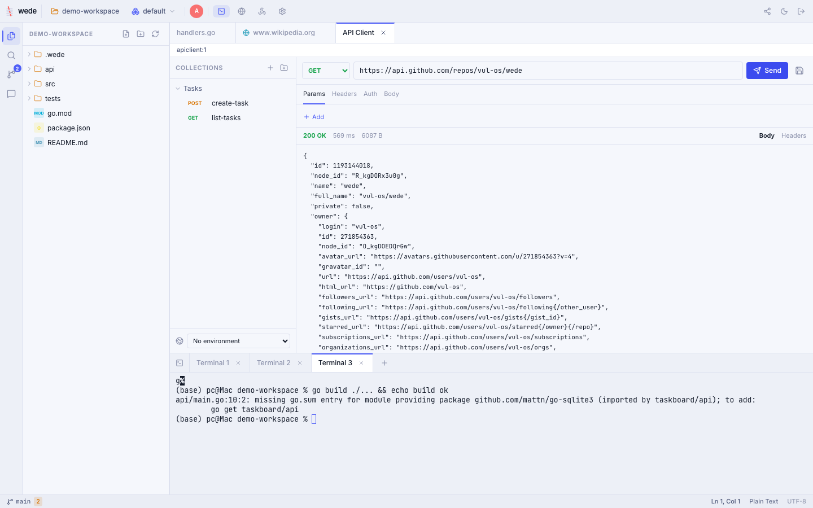
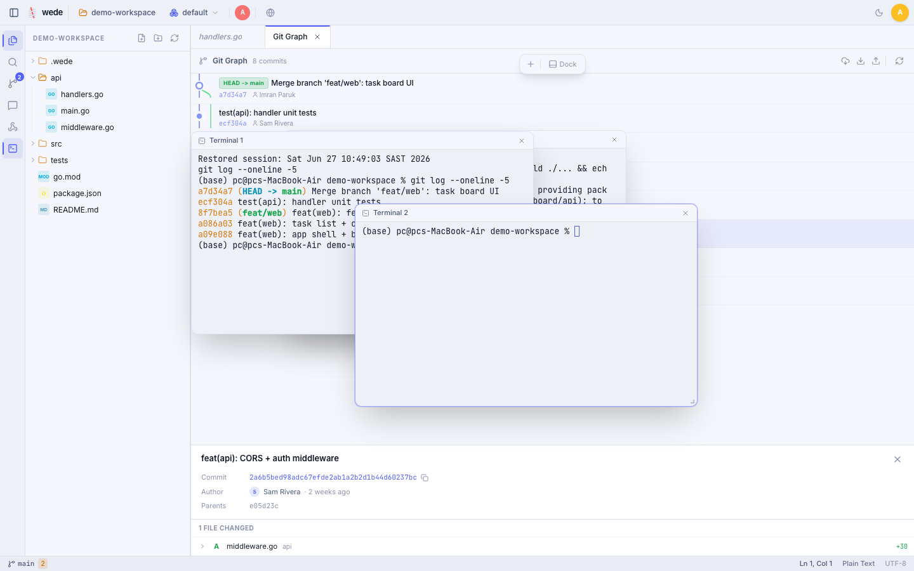
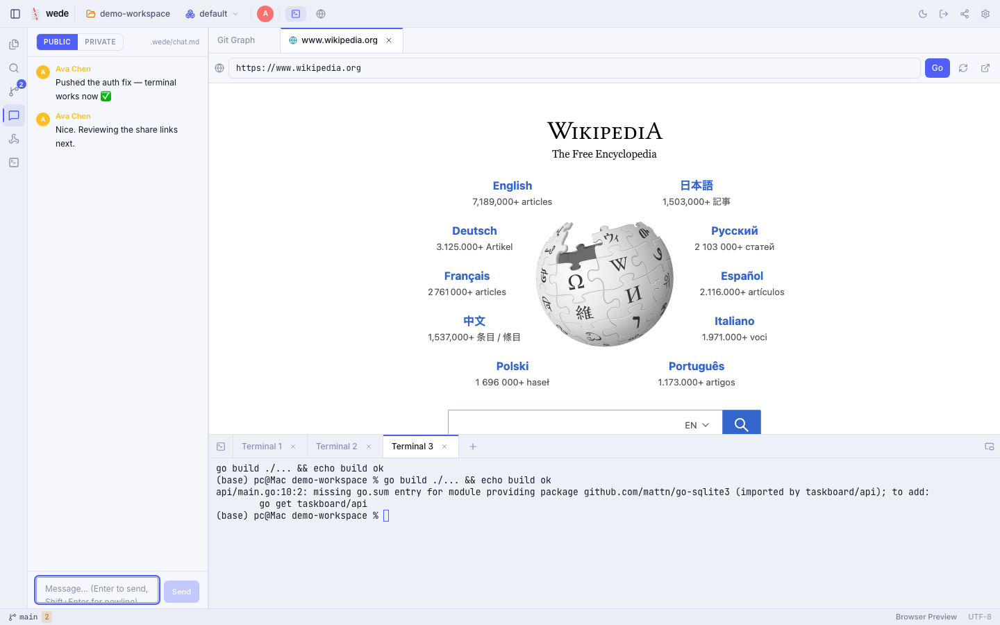
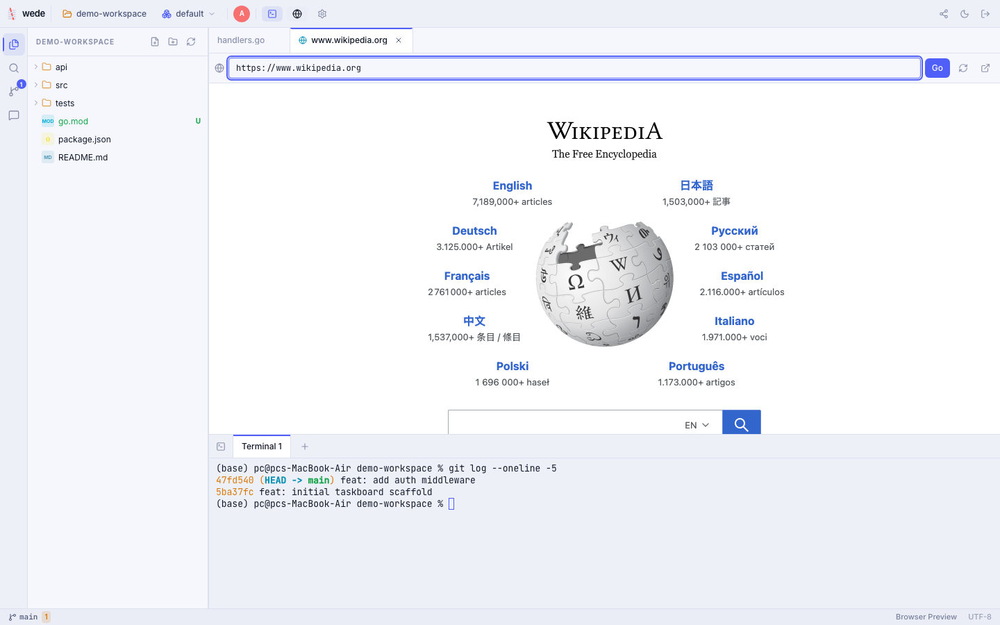

<div align="center">


# wede

**A self-hosted, collaborative web IDE in a single Go binary.**<br>
**Real-time multi-user editing, shared terminals, VS Code-grade git, and chat — all in your browser.**

[](LICENSE)
[](https://github.com/vul-os/wede/releases)
[](https://github.com/vul-os/wede/actions)
[](https://golang.org)
[](https://react.dev)

*Vulos — rooted in **vula**, the Zulu and Xhosa word for **open**.*

<sub>Part of the <strong><a href="https://vulos.org">Vulos</a></strong> OS suite &nbsp;</sub>


</div>

---

## Overview

wede is a single ~10 MB Go binary that serves a full **collaborative** web IDE straight from your machine. No cloud dependency, no Docker, no subscriptions, no database. Deploy it on a server, a NAS, a Raspberry Pi, or just run it locally — then code from any device through your browser, alone or with your whole team.

One host serves many people: open multiple projects as **workspaces**, invite others with **share links**, edit the same files with **multiplayer cursors**, share the same **terminals**, and talk in per-workspace **chat** — all with no accounts and no external services. It runs standalone or embedded as a first-class app in the [Vulos OS](https://vulos.org) shell via `frame_ancestors` iframe integration.

[Website](https://wede.vulos.org/) · [Quick start](#quick-start) · [Docs](#documentation) · [Changelog](CHANGELOG.md) · [Roadmap](ROADMAP.md)

---

## Screenshots

<table>
<tr>
<td><br><em>IDE main view — editor + file tree</em></td>
<td><br><em>Git panel — staging with inline diff</em></td>
</tr>
<tr>
<td><br><em>Git commit graph — branches, merges &amp; refs</em></td>
<td><br><em>Built-in API client (Postman-style)</em></td>
</tr>
<tr>
<td><br><em>Terminals as movable windows (synced across collaborators)</em></td>
<td><br><em>Live chat — public &amp; private channels</em></td>
</tr>
<tr>
<td><br><em>Comprehensive search (regex, globs, replace)</em></td>
<td><br><em>Settings — editor, LSP, themes, tunnel</em></td>
</tr>
<tr>
<td><br><em>Command palette (Ctrl+Shift+P)</em></td>
<td><br><em>Built-in browser preview</em></td>
</tr>
</table>

See [docs/SCREENSHOTS.md](docs/SCREENSHOTS.md) for the full gallery and how to regenerate.

---

## Collaboration

wede turns one machine into a shared workspace for your whole team — no accounts, no cloud, no external services.

- **Share links + roles** — the owner mints invite links (`?invite=…`) scoped to a role: **editor** (full access, including terminals) or **viewer** (read-only — no terminal, file writes, or git mutations). Tokens are hashed at rest and compared in constant time; the owner can list and revoke them anytime.
- **Workspaces** — open multiple independent projects on one host and switch between them from the top bar. Everyone connected sees the same set of workspaces.
- **Multiplayer presence & cursors** — see who else is in a workspace and which file they're viewing, with live cursors. Collaborative editing is CRDT-backed (pure-Go [reearth/ygo](https://github.com/reearth/ygo), Yjs-compatible).
- **Shared terminals** — everyone in a workspace shares the same PTY sessions: open a terminal and your teammates see the same output in real time.
- **Workspace chat** — per-workspace chat with two channels: **public** (committed to `.wede/chat.md` so the repo — and any LLM working on it — can read the conversation) and **private** (stored in `.wede/private/`, which wede auto-gitignores). Git activity (commits, uncommitted-change counts) is posted into the chat automatically.
- **Public tunnel** — one-click expose a loopback-bound wede to the internet via *your own* [frp](https://github.com/fatedier/frp) relay (owner-only). wede detects `frpc`, generates its config, runs it, and shows the live public URL — no inbound ports or static IP needed.

---

## Features

| Feature | Description |
|---------|-------------|
| **Real-time Collaboration** | Multi-user editing with multiplayer cursors and presence ("who's viewing what"), CRDT-backed via pure-Go reearth/ygo (Yjs-compatible). |
| **Workspaces** | Open multiple independent projects on one host and switch between them; everyone connected shares the same set. |
| **Share Links + Roles** | Owner mints invite links scoped to **editor** (full) or **viewer** (read-only) roles. Tokens hashed at rest, constant-time compare, listable and revocable. |
| **Workspace Chat** | Per-workspace chat with **public** (committed `.wede/chat.md`, LLM-readable) and **private** (auto-gitignored) channels, plus automatic git-activity messages. |
| **Public Tunnel (frp)** | One-click expose wede to the internet via your own frp relay (owner-only) — auto-detects `frpc`, generates config, shows the live URL. No inbound ports or static IP. |
| **File Explorer** | VS Code-style project tree with git status colours. Context menu: copy, paste (recursive), rename, delete with confirmation. File-watching via SSE auto-refreshes on disk changes. |
| **Code Editor** | CodeMirror 6 with syntax highlighting for JavaScript, TypeScript, Go, Python, Rust, and 10+ languages. Multi-cursor (Alt+Click), column select (Alt+Drag), bracket matching, code folding. |
| **Auto-save** | 1.5 s debounced save after each edit. Status indicator in the top bar. Toggle per-session in Settings. Manual Ctrl/Cmd+S always works. |
| **Project Search** | Ctrl/Cmd+Shift+F — workspace-wide search with ripgrep (Go walker fallback). Case and regex toggles. Replace across files. Results grouped by file; click to jump to exact line. |
| **Command Palette** | Ctrl/Cmd+Shift+P — fuzzy-search over all IDE commands: save, new file/folder, toggle terminal, git ops, theme switch, logout, and more. |
| **Web Terminal** | Full PTY terminal emulator via xterm.js and WebSocket. **Multiple terminals per workspace** (dockable or floating windows), shared live with collaborators. Run shell commands, SSH, Docker — anything. |
| **Tasks** | Named build/test/run commands from `~/.wede/tasks.json`, listed in a Tasks panel and run in a terminal ([docs](docs/GETTING-STARTED.md#tasks--named-buildtestrun-commands)). |
| **Git Client** | VS Code-grade: visual commit graph with branches &amp; merges, blame, side-by-side diff, staging + per-hunk staging, cherry-pick / revert / reset / merge, tags, branch management, push/pull/fetch, stash, merge-conflict resolution. |
| **Comprehensive Search** | Workspace-wide search with regex, case &amp; whole-word toggles, include/exclude globs, context lines, and a filename mode — plus search &amp; replace across files. |
| **Built-in Browser** | Preview your running web app in an embedded browser tab without leaving the IDE. |
| **API Client** | Postman-style HTTP client: methods, params, headers, auth (bearer/basic/api-key), JSON/form/raw bodies, environments with `{{variables}}`, and a server-side send (no CORS). Requests are saved as files under `.wede/requests/` — committable and shareable. |
| **LSP** | Language Server Protocol proxy for diagnostics, hover, completion, and go-to-definition. Ships with gopls, typescript-language-server, pylsp, rust-analyzer — and **any other LSP server can be added without recompiling** via `~/.wede/lsp.json` (see [Adding languages](docs/GETTING-STARTED.md#adding-language-support)). |
| **Syntax highlighting** | 25+ languages out of the box — Go, JS/TS/JSX, Python, Rust, C/C++, Java, PHP, C#, Kotlin, Scala, Swift, Ruby, Lua, shell, PowerShell, SQL, YAML, TOML, JSON, Markdown, HTML/CSS, Dockerfile, INI, and more. |
| **Format on Save** | Auto-formats on Ctrl/Cmd+S: `gofmt` for Go, `prettier` for JS/TS/CSS/JSON/HTML/Markdown, `black` for Python — and **any other formatter** via `~/.wede/formatters.json` ([docs](docs/GETTING-STARTED.md#format-on-save-for-any-language)). |
| **Image & Binary Preview** | Images render inline with a checkerboard background; other binary files show a size notice instead of garbled editor content. |
| **Editor Settings** | Font size, tab width, word wrap, minimap, auto-save — all live-applied without reopening files, persisted to `localStorage`. |
| **Dark & Light Themes** | Midnight (dark) and Daylight (light) colour schemes with Space Grotesk / Inter / JetBrains Mono font stack. |
| **Mobile Friendly** | Fully responsive UI for tablets and phones. |
| **Secure Access** | Owner password with 3-attempt lockout (persisted across restarts). Per-user share tokens with viewer/editor roles, hashed at rest + constant-time compare. Session TTL, server-side logout, WebSocket token in subprotocol (not URL), WS origin checks. |
| **Single binary** | Go embeds the entire frontend — one ~10 MB file to deploy anywhere. |

---

## Quick start

```bash
curl -fsSL https://raw.githubusercontent.com/vul-os/wede/main/install.sh | bash
```

The installer downloads the binary, generates a random password, and prints it. Then:

```bash
wede /path/to/your/project
```

Open [http://localhost:9090](http://localhost:9090) and log in.

Or download a binary directly from [GitHub Releases](https://github.com/vul-os/wede/releases).

---

## Configuration

wede reads a single `wede.config.json`. It searches, in order: the working
directory and its parents, `~/.config/wede/`, then next to the binary. A
`password` is required; everything else has a safe default.

```json
{
  "password": "your-strong-password-here",
  "port": "9090",
  "host": "127.0.0.1",
  "frame_ancestors": ""
}
```

| Key | Default | Description |
|-----|---------|-------------|
| `password` | *(required)* | Login password. Brute-force lockout after 3 failed attempts, persisted across restarts. |
| `port` | `9090` | HTTP port. Override at runtime with `--port` / `-p`. |
| `host` | `127.0.0.1` | Bind address. Loopback only by default; set to `0.0.0.0` to expose on the network. |
| `frame_ancestors` | `""` | CSP `frame-ancestors` allow-list for iframe embedding. Empty denies all cross-origin framing; set to e.g. `https://vulos.org` to embed in the Vulos OS shell. |

The config file holds your password and is gitignored by default — never commit
it. Start from [`wede.config.example.json`](wede.config.example.json).

### Remote access

wede binds to `127.0.0.1` by default. To reach it from elsewhere you can bind to
the LAN (`"host": "0.0.0.0"`), run it as an app inside **Vulos** (the Vulos
gateway handles routing and auth — no exposed port), or put it on the public
internet via a **VPS running [frp](https://github.com/fatedier/frp)** — the frp
client dials out from your machine, so no inbound ports or static IP are needed.
See [Exposing wede over a network](docs/GETTING-STARTED.md#exposing-wede-over-a-network)
for copy-paste configs.

CLI flags: `wede [path]` opens a workspace directly; `--port`/`-p` overrides the
port; `--version` prints the version. See [docs/CONFIGURATION.md](docs/CONFIGURATION.md)
for the full reference.

---

## Documentation

| Document | Description |
|----------|-------------|
| [docs/GETTING-STARTED.md](docs/GETTING-STARTED.md) | Installation, first steps, network exposure |
| [docs/ARCHITECTURE.md](docs/ARCHITECTURE.md) | Internal structure, API surface, security model |
| [docs/CONFIGURATION.md](docs/CONFIGURATION.md) | All config keys, iframe embedding, CLI flags |
| [docs/SCREENSHOTS.md](docs/SCREENSHOTS.md) | Screenshot gallery + how to regenerate |
| [ROADMAP.md](ROADMAP.md) | Planned features by milestone |
| [CHANGELOG.md](CHANGELOG.md) | Full version history |

---

## Development

**Prerequisites:** Go 1.25+, Node.js 18+

**Frontend** (React + Vite, hot reload):

```bash
npm install
npm run dev
```

**Backend** (Go):

```bash
cd backend
go run ./cmd/wede .
```

The Vite dev server proxies `/api` and WebSocket requests to the Go backend at port 9090.

**Production build** (single binary with embedded frontend):

```bash
npm run build:all
# outputs ./wede
```

**Tests and lint:**

```bash
cd backend && go test ./...
npm run lint
```

**Regenerate screenshots:**

```bash
npm install                          # installs playwright devDep
npx playwright install chromium      # one-time chromium download
npm run screenshots                  # auto-starts wede on scripts/demo-workspace/
```

The screenshotter starts the `./wede` binary pointed at `scripts/demo-workspace/` automatically. See [docs/SCREENSHOTS.md](docs/SCREENSHOTS.md) for environment variables and route details.

> **Security reminder:** Always set a strong, unique password in `wede.config.json` before exposing wede over a network. The example config uses a placeholder — **change it before use**. The `install.sh` installer auto-generates a random password; if you configured manually, update `wede.config.json` now.

---

## Contributing

Contributions are welcome!

1. Fork the repository
2. Create a feature branch: `git checkout -b feat/my-feature`
3. Commit your changes: `git commit -m 'feat: add my feature'`
4. Push to the branch: `git push origin feat/my-feature`
5. Open a pull request

Please keep the Go tests and lint clean (`go test ./...` + `npm run lint`) before submitting.

---

## License

[MIT](LICENSE) — free to use, modify, and distribute.

---

<div align="center">

<a href="https://wede.vulos.org">Website</a> · <a href="https://github.com/vul-os/wede/issues">Issues</a> · <a href="https://github.com/vul-os/wede/releases">Releases</a>

<br>

<sub>wede is a free, open-source, self-hosted <strong>collaborative</strong> web IDE and remote development environment.<br>
Built as an alternative to code-server, VS Code Server, Gitpod, and GitHub Codespaces.<br>
Keywords: collaborative web IDE, self-hosted IDE, real-time pair programming, multiplayer code editor,<br>
shared terminal, browser code editor, remote development, online terminal, git client,<br>
open source IDE, developer tools, Go web server, single binary IDE.</sub>

</div>
