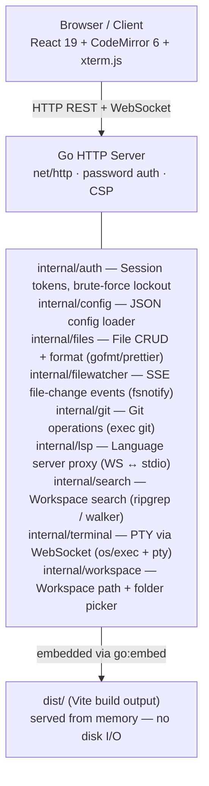
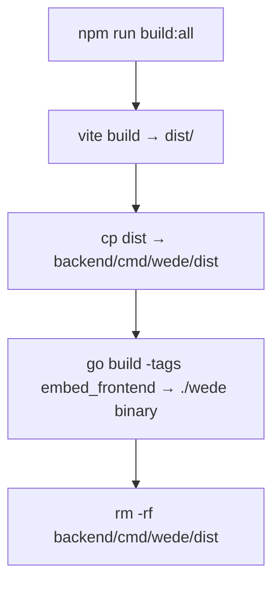

# wede Architecture

wede is a single-binary Go + React web IDE. This document describes the internal structure.

---

## Overview

---

## Frontend

| Layer | Technology |
|-------|-----------|
| Framework | React 19 |
| Build tool | Vite 8 |
| Styling | Tailwind CSS 4 |
| Code editor | CodeMirror 6 |
| Terminal | xterm.js (`@xterm/xterm`) |
| Icons | Lucide React |
| Fonts | Space Grotesk · Inter · JetBrains Mono |
| LSP client | `codemirror-languageserver` |

The frontend is a single-page application (SPA) built with Vite. In production it is embedded directly into the Go binary via `go:embed`, so no separate file serving is needed.

### Key components (`src/components/`)

| Component | Purpose |
|-----------|---------|
| `IDE.jsx` | Top-level layout — sidebar, panels, editor area |
| `Editor.jsx` | CodeMirror 6 integration, language detection, LSP wiring |
| `FileExplorer.jsx` | VS Code-style tree, context menu, git status colours |
| `GitPanel.jsx` | Staging, commit graph (SVG DAG), push/pull/fetch |
| `Terminal.jsx` + `TerminalPanel.jsx` | xterm.js PTY tabs |
| `SearchPanel.jsx` | Workspace search + replace-across-files |
| `CommandPalette.jsx` | Fuzzy-search command palette (`Ctrl+Shift+P`) |
| `Settings.jsx` | Editor settings, LSP status, theme picker |
| `Login.jsx` | Password authentication form |
| `Browser.jsx` | Embedded browser preview tab |

---

## Backend

The backend is a single Go binary (`backend/cmd/wede/main.go`). All services are plain `net/http` handlers — no framework.

### Authentication (`internal/auth`)

- Single shared password from `wede.config.json`
- Login returns a 32-byte hex session token (24 h TTL)
- Tokens persisted to `~/.wede/sessions.json` — survive server restart
- 3-attempt brute-force lockout persisted to `~/.wede/lockout.json`
- Server-side logout via `DELETE /api/auth/logout`
- WebSocket auth uses `auth.<token>` subprotocol — token never appears in URL

### File operations (`internal/files`)

All paths are validated through `safePath()` which confines operations to the open workspace directory. The check uses `strings.HasPrefix(full, ws+separator)` (not just `ws`) to prevent prefix-collision attacks.

### Git (`internal/git`)

Git operations are implemented by shelling out to the `git` binary. Arguments are validated to prevent injection:
- Branch names checked to not start with `-`
- Commit hashes validated as hex only
- `git add` uses `--` separator
- All paths go through `safePath()`

### Terminal (`internal/terminal`)

Full PTY via `os/exec` + `github.com/creack/pty`. The PTY is bridged to a WebSocket. Auth token is passed as a WebSocket subprotocol (`auth.<token>`), not in the URL.

### LSP proxy (`internal/lsp`)

Spawns one language server process per (workspace, language) pair and bridges JSON-RPC `Content-Length` framing to/from a WebSocket. Built-in: `gopls`, `typescript-language-server`, `pylsp`, `rust-analyzer`; the registry is extended at startup from `~/.wede/lsp.json` (`LoadConfig`) so any LSP server can be added without recompiling. The extension→language map is served to the client via `/api/lsp/available`. Degrades gracefully when binaries are not installed.

### Search (`internal/search`)

Workspace-wide text search. Uses `ripgrep` when available on `$PATH`, falls back to a pure-Go `filepath.Walk` scanner. Supports literal, case-insensitive, and regex modes. Results capped at 500 matches; replace-across-files capped at 200 files / 10k replacements.

### File watching (`internal/filewatcher`)

Uses `fsnotify` to watch the workspace directory. Events are debounced (250 ms) and streamed to the browser via Server-Sent Events (`GET /api/watch`).

---

## Security model

### Role model

Every authenticated session carries one of three roles:

| Role | How it is obtained | Capabilities |
|------|--------------------|--------------|
| **owner** | Config-password login | Full access; can mint/revoke share tokens |
| **editor** | Redeem an editor share link | Full access including terminal, LSP, DAP, file writes, git mutations |
| **viewer** | Redeem a viewer share link | Read-only: file/git reads, search, collab presence — no shell, no writes |

The role is stored in the session entry (server-side) and injected into the request context by `auth.Middleware`. Mutating and shell-access routes are wrapped with `auth.RequireEditor`, which rejects viewer sessions with 403 Forbidden before the underlying handler is reached. Owner-only operations (token management, tunnel control) use `auth.RequireOwner`.

**Editor-gated routes** (viewer → 403): terminal WebSocket, LSP WebSocket, DAP WebSocket, file writes/creates/deletes/renames, git mutations, workspace create/delete, CRDT doc socket, search replace, API client send/save.

### No-sandbox warning for shared deployments

> **WARNING — shared editor access = unsandboxed host shell.**
>
> When you share an **editor** link, the recipient gains access to a full login shell
> (`exec.Command(shell, "-l")`) running as the OS user that started wede, with the
> complete process environment inherited (`os.Environ()`). The working directory
> (`cmd.Dir`) is set to the workspace root as a UX convenience only — it does **not**
> confine the shell in any way. The editor can `cd /`, read `~/.ssh`, run `sudo`,
> install packages, or do anything the wede process owner can do.
>
> The same applies to the LSP WebSocket: connecting to it spawns a language server
> binary (e.g. `rust-analyzer`, `gopls`) as a child of the wede process, with full
> filesystem and network access.
>
> **This is by design** — wede is a developer tool, not a sandboxed IDE-as-a-service.
> Treat editor links like SSH keys: share them only with people you would give a shell
> account to. Viewer links are safe for read-only access.

| Concern | Mitigation |
|---------|-----------|
| Path traversal | `safePath()` with separator-aware prefix check |
| Git arg injection | Allowlist validation on branch names, hashes, remote names |
| XSS / framing | `X-Frame-Options: DENY` + `Content-Security-Policy` by default |
| Brute force | 3-attempt lockout persisted to disk |
| Token leakage | WS token in subprotocol, never in URL or logs |
| Credential logging | Password redacted from all log output |
| Viewer → shell escalation | Terminal, LSP, DAP, workspace-delete routes wrapped in `RequireEditor`; viewer sessions get 403 |

---

## Build system

The `embed_frontend` build tag switches between `frontend_embed.go` (serves from embedded `dist/`) and `frontend_dev.go` (serves from `./dist/` on disk, for hot-reload dev mode).

---

## API surface

The API is a REST + WebSocket interface served at `/api/`. All endpoints except auth are protected by the auth middleware.

See the route list in `backend/cmd/wede/main.go` for the full API surface.
