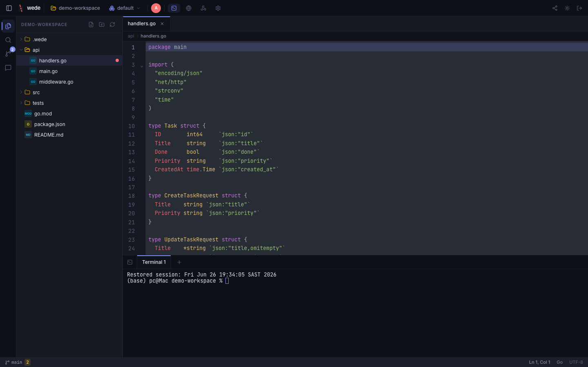
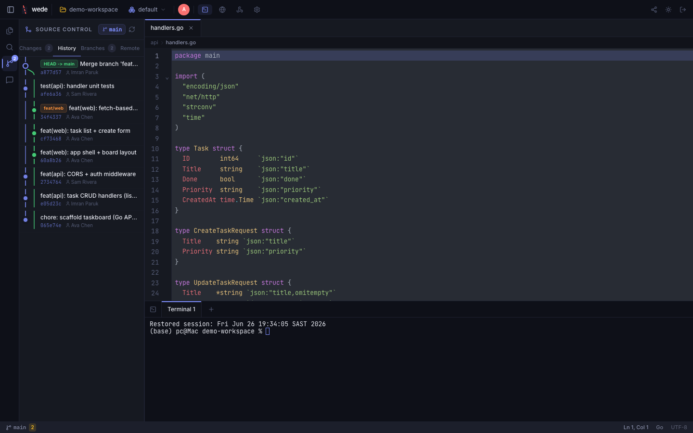
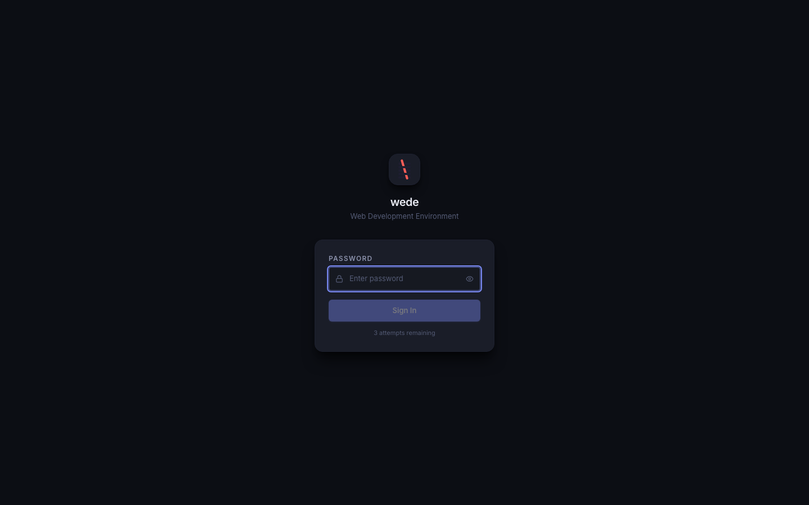

# wede Screenshots

Visual tour of the IDE. All screenshots are captured at 1440×900 against the
`scripts/demo-workspace/` project (taskboard — Go API + React frontend) so
every panel shows realistic developer content.

The gallery below is the **light (Daylight)** theme; the matching **dark
(Midnight)** set lives in [`screenshots/dark/`](screenshots/dark/). Regenerate
with `npm run screenshots` (light) or `WEDE_THEME=dark npm run screenshots`.

### Both themes at a glance

| Light (Daylight) | Dark (Midnight) |
|------------------|-----------------|
|  |  |
|  |  |

---

## Gallery

### Login



The password authentication screen.

---

### IDE — Editor + File Tree


Full IDE layout: file explorer on the left with the `api/` folder expanded,
`handlers.go` open in the editor with Go syntax highlighting, top bar with
workspace controls.

---

### Git Panel — Changes


Staging area with inline diff view. The demo workspace has an unstaged edit in
`api/middleware.go` (rate-limiter stub) so the diff is real.

---

### Git Commit Graph


Visual SVG DAG of branch/merge history. The demo workspace has two commits so
the graph is populated. Right-click commits for the context menu.

---

### Search Panel


Workspace-wide search with ripgrep. The query `handleCreate` returns real hits
across the Go source files. Supports regex, case-toggle, and replace-across-files.

---

### Terminal


Full PTY terminal panel with multiple tabs. The capture shows `git log --oneline`
output inside the demo workspace.

---

### Settings


Editor settings: font size, tab width, word wrap, auto-save, minimap, LSP, and
theme picker.

---

### Command Palette


`Ctrl+Shift+P` — fuzzy-search over all IDE commands. The capture shows the
palette filtered to `git` commands.

---

### Mobile layout


Fully responsive layout for tablets and phones. *(manual capture)*

---

### Built-in browser preview


Embedded browser tab for previewing your running app (shown loading wikipedia.org).

---

### Light theme (Daylight)


Daylight colour scheme. *(manual capture)*

---

## Regenerating screenshots

The screenshotter auto-starts the `wede` binary pointed at `scripts/demo-workspace/`
if it is not already running. Run:

```bash
npm run screenshots
```

### Prerequisites

- Node.js 18+
- `npm install` (installs Playwright)
- `npx playwright install chromium`
- The `./wede` binary must exist (`npm run build:all` to rebuild it)

### Environment variables

| Variable | Default | Description |
|----------|---------|-------------|
| `BASE_URL` | `http://localhost:9090` | wede instance URL |
| `WEDE_PASSWORD` | `admin` | Login password |

If `BASE_URL` points at an already-running wede instance the auto-start is
skipped and that instance is used instead.

### Routes captured

| Screenshot file | Route / action | Content |
|----------------|----------------|---------|
| `login.png` | `/` before login | Password prompt |
| `hero.png` | IDE main view | `api/handlers.go` open, file tree expanded |
| `git.png` | Git panel — Changes tab | Unstaged diff in `api/middleware.go` |
| `git_graph.png` | Git panel — History | Two-commit SVG graph |
| `search.png` | Search panel (`Ctrl+Shift+F`) | Query `handleCreate`, real hits |
| `terminal.png` | Terminal panel | `git log --oneline` output |
| `settings.png` | Settings panel | Editor preferences |
| `command_palette.png` | Command palette (`Ctrl+Shift+P`) | Filtered to `git` |

### Demo workspace

`scripts/demo-workspace/` is a small self-contained project committed in this
repo. It has:

- `api/` — Go HTTP server (main.go, handlers.go, middleware.go)
- `src/` — React frontend (App.jsx, components/, utils/)
- `tests/` — Go table tests
- `README.md`, `package.json`

The workspace git repo has 2 commits and an intentional unstaged edit so the
git diff view is always populated.
