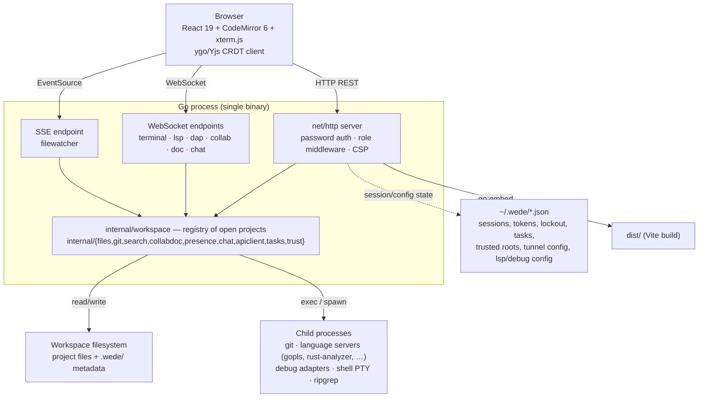
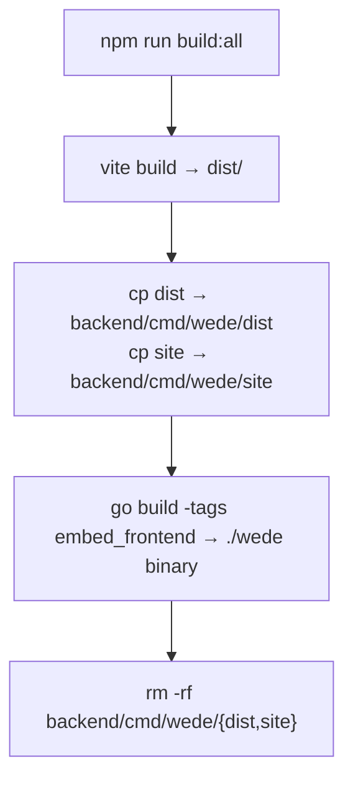

<!-- Generated from docs/ARCHITECTURE.md by scripts/sync-docs.mjs — edit the source, not this file. -->

# wede Architecture

wede is a single-binary Go + React web IDE with real-time multiplayer editing. This document describes the internal structure: process model, package inventory, real-time layer, and security model.

---

## 1. Overview

wede has no database and no separate backend process. One Go binary embeds the built frontend (`go:embed`) and serves everything — REST API, WebSockets, and (optionally) a marketing landing page — from a single `net/http.ListenAndServe`. All durable state is either files in the open workspace (source code, `.wede/` metadata) or small JSON files under `~/.wede/` on the host running wede.

---

## 2. Process model & data flow

- **One OS process, no supervisor.** `backend/cmd/wede/main.go` builds one `http.ServeMux`, wires every package's handlers into it, and calls `http.ListenAndServe`. Ctrl-C / `SIGTERM` stops the public tunnel (if running) before exit.
- **Workspaces are in-memory, keyed by ID.** `internal/workspace.Manager` (`wsMgr`) holds a map of open `*Workspace`s. The process boots with one workspace, `"default"`, rooted at the CLI path argument (or the last-opened folder). Additional projects can be opened via `POST /api/workspaces`, each getting its own isolated root and its own lazily-constructed files/git/search/terminal/lsp/dap/presence/collab/chat/apiclient/docs handlers (see `Workspace` in `internal/workspace/workspace.go`). Closing a workspace tears down its watcher, terminal sessions, LSP processes, presence hub, chat hubs, and CRDT doc server/persistence.
- **Per-workspace disk state lives under `.wede/`** at the workspace root (or wherever `WedeLocation` points it — see §7). This holds `chat.md` / `private/chat.md`, saved API-client `requests/` and `environments/`, and (opt-in, trust-gated) project tooling config such as `.wede/tasks.json`, `.wede/debug.json`, `.wede/formatters.json`.
- **Host-wide state lives under `~/.wede/`** on the machine running the wede binary — independent of any workspace:

  | File | Package | Contents |
  |------|---------|----------|
  | `sessions.json` | `auth` | Active session tokens (hashed), role, username, creation time |
  | `tokens.json` | `auth` | Outstanding share-token metadata (hashed) |
  | `lockout.json` | `auth` | Brute-force attempt counter / locked flag |
  | `recent.json` | `folder` | Recently opened folder paths |
  | `wede-hosts.json` | `workspace` | Per-workspace-root override of which subfolder hosts `.wede/` |
  | `tasks.json` | `tasks` | Owner-global named run/build/test commands |
  | `trusted.json` | `trust` | Workspace roots the owner has approved to run committed `.wede/` tooling config |
  | `tunnel.json` | `tunnel` | Public-tunnel (relay) configuration |
  | `lsp.json` | `lsp` | User-added language-server registry entries |
  | `debug.json` | `dap` | User-added debug-adapter registry entries |
  | `formatters.json` | `files` | User-added formatter registry entries |

  None of this is a database — every file is loaded on demand and rewritten wholesale (or via atomic temp+rename for larger content) on change.
- **Child processes** are spawned per feature, always with the working directory pinned to a validated workspace root and binaries resolved via `exec.LookPath` (never a client-supplied path): `git` (one-shot per operation), one language-server process per (workspace, language) pair (`gopls`, `typescript-language-server`, `pylsp`, `rust-analyzer`, ...), one debug-adapter process per debug session (killed when the session ends), one login shell per terminal tab (PTY), and `ripgrep` for search when present on `$PATH`.

---

## 3. Backend package inventory

`backend/internal/` — 19 packages, all plain `net/http` handlers wired together in `main.go`. No web framework.

| Package | Responsibility |
|---------|-----------------|
| `auth` | Password login, session tokens (hashed, 24 h TTL, persisted), brute-force lockout, share-token mint/redeem/revoke, role resolution (`owner`/`editor`/`viewer`), `Middleware`/`RequireEditor`/`RequireOwner` |
| `config` | Loads `wede.config.json` (password, port, host, frame-ancestors, workspace root, serve-landing flag) |
| `folder` | Root-folder open/browse/recents; enforces the allowed workspace base (`cfg.WorkspaceRoot`) on any runtime folder-open/workspace-create |
| `workspace` | Multi-project registry (`Manager`); one `Workspace` per open project owning its own lazily-built files/git/search/watcher/terminal/lsp/dap/presence/collab/chat/apiclient/docs handlers; also owns the `.wede`-location relocation feature (`wedehost.go`) |
| `files` | File CRUD (list/tree/read/write/create/delete/rename/copy) + formatter dispatch (gofmt/prettier/etc., extensible via `formatters.json`); all paths pass through a workspace-confining `safePath()` |
| `filewatcher` | `fsnotify` watch on the workspace root, 250 ms debounce, pushed to the browser via SSE (`GET /api/workspaces/{id}/watch`) |
| `search` | Workspace text search (ripgrep with pure-Go `filepath.Walk` fallback) and filename search; literal/case-insensitive/regex modes; replace-across-files (previewed then applied), capped at 500 matches / 200 files / 10k replacements |
| `git` | Git operations by shelling out to `git`: status/log/diff/stage/commit/branches/checkout/fetch/pull/push/remotes/stash/blame/tags/cherry-pick/revert/reset/merge/tag/conflict-resolve/stage-hunk. Argument validation (no leading `-` in branch names, hex-only hashes, `--` separators) guards against injection |
| `terminal` | Shared PTY sessions per workspace (`github.com/creack/pty` + `os/exec`), bridged to a WebSocket; auth token passed as a `auth.<token>` WS subprotocol, never in the URL |
| `lsp` | WebSocket↔stdio proxy for Language Server Protocol; one process per (workspace, language); built-in registry extendable via `~/.wede/lsp.json`; degrades gracefully (a JSON notice, not an error) when a server binary isn't installed |
| `dap` | Same proxy pattern as `lsp` but for the Debug Adapter Protocol; a fresh adapter process per debug session, killed on socket close; adapter registry extendable via `~/.wede/debug.json` or a trusted workspace's `.wede/debug.json` |
| `tasks` | Serves named run/build/test commands from `~/.wede/tasks.json` (global) and a trusted workspace's `.wede/tasks.json`; parses and lists only — the command text runs client-side in a terminal, which is itself editor-gated |
| `trust` | Owner-controlled allowlist (`~/.wede/trusted.json`) of workspace roots permitted to have their committed `.wede/` tooling config (tasks, debug adapters, formatters) honoured — stops a collaborator from running arbitrary host commands via a committed config file |
| `apiclient` | Built-in Postman-style HTTP request runner; requests/environments persisted as JSON under `.wede/requests/` and `.wede/environments/`; server-side send proxy (no browser CORS limits); SSRF-guarded (private/loopback targets blocked by default) |
| `presence` | Transport-agnostic hub tracking who is connected to a room and what file/line each member is viewing; broadcasts the full roster on any change |
| `collab` | Per-workspace collaboration WebSocket carrying presence (roster + cursor position); origin-checked the same way as terminal/lsp |
| `collabdoc` | Server-authoritative CRDT document layer built on `github.com/reearth/ygo` (pure-Go, cgo-free, Yjs-v13 wire-compatible); `DocStore` holds one CRDT doc per open file; `DiskPersistence` seeds docs from disk and debounce-writes materialized text back (atomic temp+rename) |
| `chat` | Per-workspace live chat (public + private channel) with Markdown persistence (`.wede/chat.md`, `.wede/private/chat.md`) and git-activity notifications merged into history; deliberately available to all authenticated roles including viewers |
| `tunnel` | Owner-only public exposure without opening ports: an embedded reverse-tunnel agent (`vulos-relay/tunnel/agent`) dials the owner's own relay server over `wss://` and proxies inbound traffic to wede's loopback port; mechanism is behind a `Provider` seam so an alternate tunnel (Cloudflare Tunnel, ngrok, frp, Tailscale Funnel) can be substituted |

---

## 4. Frontend structure

| Layer | Technology |
|-------|-----------|
| Framework | React 19 |
| Build tool | Vite |
| Styling | Tailwind CSS |
| Code editor | CodeMirror 6 (`codemirror-languageserver` for LSP) |
| Terminal | xterm.js (`@xterm/xterm`) |
| CRDT client | `reearth/ygo`'s Yjs-compatible provider (WebSocket sync + awareness) |
| Icons | Lucide React |

The frontend is a single-page application. In production it is embedded directly into the Go binary via `go:embed` (see §8) — there is no separate static file server.

### Components (`src/components/`, ~34 files)

| Area | Components |
|------|-----------|
| Shell / navigation | `IDE.jsx` (top-level layout), `Breadcrumbs.jsx`, `CommandPalette.jsx`, `QuickOpen.jsx`, `MobileNav.jsx`, `WorkspaceSwitcher.jsx`, `Logo.jsx`, `ThemePicker.jsx` |
| Editing | `Editor.jsx` (CodeMirror integration, language detection, LSP wiring), `EditorTabs.jsx`, `RemoteCursors.jsx` (renders peers' live cursors from the CRDT/presence layer), `MarkdownPreview.jsx`, `ImagePreview.jsx` |
| Files | `FileExplorer.jsx`, `FolderPicker.jsx`, `WedeLocation.jsx` (owner-only relocation of the `.wede/` metadata host folder — see §7) |
| Git | `GitPanel.jsx`, `GitPanels.jsx`, `GitGraphView.jsx` (commit DAG) |
| Terminal | `Terminal.jsx`, `TerminalPanel.jsx`, `TerminalToolbar.jsx`, `FloatingTerminals.jsx` |
| Search | `SearchPanel.jsx` |
| Debugging & tasks | `DebugPanel.jsx` (DAP front end), `TasksPanel.jsx` |
| API client | `ApiClient.jsx`, `ApiCollections.jsx` |
| Collaboration | `Chat.jsx`, `PresenceRoster.jsx`, `ShareModal.jsx` (mint/manage editor & viewer share links) |
| Sharing infra | `TunnelSettings.jsx` (owner-only public tunnel controls) |
| Browsing / auth / settings | `Browser.jsx` (embedded preview tab), `Login.jsx`, `Settings.jsx` |

### Hooks (`src/hooks/`) and lib (`src/lib/`)

`useAuth`, `useWorkspaces`, `useCollab`, `useYDoc` (CRDT doc lifecycle), `useChat`, `useLSP`, `useDap`, `useApiClient`, `useTerminals`, `useMobile`, `useTheme` encapsulate the WebSocket/CRDT/state wiring per feature so components stay presentational. `src/lib/` holds pure helpers: `activeWorkspace.js`, `apiRequest.js` (auth-aware fetch that rewrites legacy paths to `/api/workspaces/{id}/...`), `fileKey.js`, `gitGraph.js`, `terminalName.js`, `wsScope.js`, `breakpoints.js` — most have a co-located `*.test.js`.

---

## 5. Real-time layer

wede's multiplayer features run over several independent WebSocket channels per workspace, all mounted under `/api/workspaces/{id}/...`:

| Endpoint | Package | Carries |
|----------|---------|---------|
| `GET .../collab` | `collab` + `presence` | Roster (who's connected) and cursor position (`{file, line}`) per member |
| `GET .../doc/{room...}` | `collabdoc` (via `ygo` provider) | CRDT sync + awareness for one open file; `{room}` is the file's workspace-relative path, base64url-encoded by the client |
| `GET .../chat?channel=public\|private` | `chat` | Live chat messages + git-activity notices |
| `GET .../terminal` | `terminal` | PTY I/O (shared session, multiple viewers can attach) |
| `GET .../lsp` | `lsp` | LSP JSON-RPC framing |
| `GET .../dap` | `dap` | DAP JSON framing |

### CRDT collaborative editing

Concurrent editing is powered by `github.com/reearth/ygo` — a pure-Go, cgo-free CRDT implementation that is wire-compatible with Yjs, so the browser uses a standard Yjs-style WebSocket provider. `internal/workspace.Workspace.DocServer()` lazily builds one `ywebsocket.Server` per workspace, backed by a `collabdoc.DiskPersistence` adapter:

- **`LoadDoc`** seeds a new in-memory CRDT document from the file's current on-disk contents the first time it's opened.
- **`StoreUpdate`** fires on every incremental edit. Rather than persist opaque CRDT update blobs, wede debounces (600 ms default) and then writes the document's fully materialized text back to the file, via **atomic temp-file + rename** so a crash mid-write never corrupts the file.
- The doc socket is **editor-gated** (`RequireEditor`): it drives writes to workspace files, so a viewer session must not be able to connect to it.
- Reconciling external disk changes (e.g. a `git checkout` or a terminal-driven edit) into an already-open CRDT doc is a known open item — not yet implemented; today external changes race with an open doc's write-back.

### Presence

`presence.Hub` is a transport-agnostic roster: each connected member has an outbound JSON-event channel; any join/leave/cursor-move triggers a full-roster rebroadcast (simple, and cheap enough for the small-team scale wede targets). `collab.Handler` is the thin WebSocket pump on top of it — it is *not* gated to editors, since read-only viewers should still see who else is present.

### Chat

`chat.Hub` follows the same transport-agnostic pattern as presence. Public-channel messages persist to `.wede/chat.md` (git-committable, LLM-readable); private-channel messages persist to `.wede/private/chat.md` (gitignored by default). The hub also polls git and merges recent commit activity into the message history so pushes/commits show up as chat events. Chat is deliberately **not** editor-gated — any authenticated role, including viewers, may read and post; inbound text is control-character-sanitized so a post can never inject extra lines into the Markdown log.

---

## 6. Security model

### Role model

Every authenticated session carries one of three roles:

| Role | How it is obtained | Capabilities |
|------|--------------------|---------------|
| **owner** | Config-password login | Full access; mint/revoke share tokens; owner-only routes (tunnel control, workspace trust, `.wede` relocation) |
| **editor** | Redeem an editor share link | Full access including terminal, LSP, DAP, file writes, git mutations, CRDT doc writes |
| **viewer** | Redeem a viewer share link | Read-only: file/git reads, search, presence, chat (read **and** post) — no shell, no writes, no CRDT doc socket |

The role is stored server-side in the session entry and injected into the request context by `auth.Middleware`. Mutating and shell-access routes are wrapped with `auth.RequireEditor`, which rejects viewer sessions with `403 Forbidden` before the underlying handler runs. Owner-only operations use `auth.RequireOwner`.

**Editor-gated routes** (viewer → 403): terminal WebSocket, LSP WebSocket, DAP WebSocket, CRDT doc socket (`/doc/{room...}`), file writes/creates/deletes/renames/copies/format, git mutations (stage/commit/push/pull/fetch/checkout/branch/stash/cherry-pick/revert/reset/merge/tag/conflict-resolve), workspace create/close, folder-open, search replace, API-client send/save/delete.

**Owner-only routes**: share-token mint/list/revoke, public-tunnel get/configure/start/stop, workspace trust get/set/revoke, `.wede`-location get/set.

**Not gated at all** (available to viewers): file/git/search reads, filewatcher SSE, LSP/DAP "available" listings, presence/collab socket, chat (both read and post).

### Middleware & hardening

- `securityHeaders` (wraps the whole mux) sets `X-Content-Type-Options: nosniff`, `Referrer-Policy: strict-origin-when-cross-origin`, and either `X-Frame-Options: DENY` + `frame-ancestors 'self'` (default, standalone) or `frame-ancestors <configured origins>` only (when `cfg.FrameAncestors` is set, e.g. to allow embedding inside the Vulos OS shell).
- Session tokens and share tokens are stored **hashed** (`sha256`) in `~/.wede/sessions.json` / `tokens.json` — the raw token exists only in the client's possession and the momentary login/redeem response.
- WebSocket auth uses an `auth.<token>` **subprotocol**, never a URL query parameter, so tokens don't end up in server logs or browser history.
- Brute-force login lockout (3 attempts) persists to `~/.wede/lockout.json` so a restart doesn't reset the counter.
- File/path operations are confined to the workspace via `safePath()`, which checks `strings.HasPrefix(full, ws+separator)` — the separator-aware form, so `…/workspace-evil` can't be mistaken for a path inside `…/workspace`.
- Runtime folder-open / workspace-create requests are confined to `cfg.WorkspaceRoot` (default: `$HOME`) and reject the base itself, the filesystem root, or dotfile path components — an authenticated editor can't adopt `~/.ssh` or `/` as a workspace root. The CLI boot path is exempt (it's the owner's explicit launch choice).
- Git argument validation rejects branch names starting with `-`, requires hex-only commit hashes, and uses `--` separators before paths, to prevent flag-injection into the `git` subprocess.
- Language-server and debug-adapter binaries are resolved via `exec.LookPath` only — never a client-supplied path — and their working directory is always the validated workspace root.
- Project-level tooling config (`.wede/tasks.json`, `.wede/debug.json`, `.wede/formatters.json`) is **only honoured for trusted workspaces** (`internal/trust`, owner-controlled `~/.wede/trusted.json`). This exists specifically so a collaborator with editor access can't get the owner to run arbitrary host commands just by committing a malicious task/debug config — the owner's own global `~/.wede/` config is always trusted.
- The API-client send proxy blocks requests to loopback/private/link-local targets by default (SSRF hardening for a server-side HTTP forwarder).

### No-sandbox warning for shared deployments

> **WARNING — shared editor access = unsandboxed host shell.**
>
> When you share an **editor** link, the recipient gains access to a full login shell
> (`exec.Command(shell, "-l")`) running as the OS user that started wede, with the
> complete process environment inherited (`os.Environ()`). The working directory
> (`cmd.Dir`) is set to the workspace root as a UX convenience only — it does **not**
> confine the shell in any way. The editor can `cd /`, read `~/.ssh`, run `sudo`,
> install packages, or do anything the wede process owner can do.
>
> The same applies to the LSP and DAP WebSockets: connecting to either spawns a
> language-server or debug-adapter binary (e.g. `rust-analyzer`, `gopls`, `delve`) as
> a child of the wede process, with full filesystem and network access. The CRDT doc
> socket, while not itself a shell, lets an editor overwrite any file in the
> workspace.
>
> **This is by design** — wede is a developer tool, not a sandboxed IDE-as-a-service.
> Treat editor links like SSH keys: share them only with people you would give a shell
> account to. Viewer links are safe for read-only access, including chat.

### Mitigations

| Concern | Mitigation |
|---------|-----------|
| Path traversal | `safePath()` with separator-aware prefix check |
| Workspace-root escape | `cfg.WorkspaceRoot` allowlist + dotfile/root/base rejection on folder-open and workspace-create |
| Git arg injection | Allowlist validation on branch names, hashes, `--` separators |
| XSS / framing | `X-Frame-Options: DENY` + `Content-Security-Policy: frame-ancestors` (default `'self'`) |
| Brute force | 3-attempt lockout persisted to disk |
| Token leakage | WS token in subprotocol, never in URL or logs; tokens stored hashed at rest |
| Credential logging | Password redacted from all log output |
| Viewer → shell escalation | Terminal, LSP, DAP, CRDT-doc, and workspace-mutation routes wrapped in `RequireEditor`; viewer sessions get 403 |
| Untrusted project config → host RCE | `.wede/{tasks,debug,formatters}.json` honoured only for owner-trusted workspace roots |
| Server-side request forgery (API client) | Loopback/private/link-local targets blocked by default in the send proxy |
| Unbounded relay exposure | Public tunnel is owner-only (`RequireOwner`) and always targets wede's own loopback port, never an arbitrary host |

---

## 7. Extension points

| Extension | Config file | Trust requirement |
|-----------|------------|--------------------|
| Language servers | `~/.wede/lsp.json` (global, loaded at startup via `lsp.LoadConfig`) | None (global config is owner-controlled by definition) |
| Debug adapters | `~/.wede/debug.json` (global) or a trusted workspace's `.wede/debug.json` | Project-level entries require the workspace to be in `trust.trusted.json` |
| Formatters | `~/.wede/formatters.json` (global) | None for global; project-level formatter config follows the same trust gate |
| Tasks (run/build/test commands) | `~/.wede/tasks.json` (global); project-level `.wede/tasks.json` planned behind the same trust gate | Global only today; commands still execute client-side in an editor-gated terminal |

**Workspace trust** (`internal/trust`) is the gate that makes all of the above project-level extension points safe: a workspace root only has its committed `.wede/` tooling config honored after the **owner** explicitly trusts it (`GET/POST/DELETE /api/workspaces/{id}/trust`, all `RequireOwner`). Without this, an editor-role collaborator could get the owner to execute arbitrary host commands simply by pushing a crafted `.wede/tasks.json` or `.wede/debug.json` into the shared repo. The owner's own global `~/.wede/*.json` config is implicitly trusted since only the owner can write it.

### `WedeLocation` — relocating the `.wede/` metadata folder

For multi-root workspaces (a workspace root that contains several independent projects/repos as subfolders), `.wede/` defaults to living at the workspace root, which may not be inside any of the actual git repos. `internal/workspace/wedehost.go` lets the **owner** designate which workspace-relative subfolder physically hosts `.wede/` instead, so its contents (chat history, saved API requests, tooling config) get committed into that project's own repo:

- The choice is persisted per absolute workspace root in `~/.wede/wede-hosts.json` (workspaces themselves are in-memory only).
- `GET /api/workspaces/{id}/wede-location` reads the current host folder; `PUT` changes it and **moves** the existing `.wede/` contents to the new location. Both routes are `RequireOwner`.
- The frontend surface is `src/components/WedeLocation.jsx`; all per-workspace consumers of `.wede/` (chat, API client) resolve their path through the current host so they keep working transparently after a relocation.

---

## 8. Build & embedding

- The `embed_frontend` build tag switches between `frontend_embed.go` (serves the SPA from an embedded `dist/` via `go:embed`) and `frontend_dev.go` (serves `./dist/` from disk, for hot-reload dev mode with `npm run dev` + `npm run dev:backend` side by side).
- `site_embed.go` / `site_dev.go` follow the same pattern for the repo-root `site/` directory — a standalone marketing landing page + a self-contained docs viewer, mounted at `/site/*` so it never shadows the IDE app (which lives at `/`, behind sign-in). This is controlled by `cfg.ServeLanding` (default `false`): a local self-hosted wede just serves the IDE; the flag is meant for a cloud-hosted deployment (e.g. `wede.vulos.org`) that also wants a public landing page.
- Root-path (`/`) behavior: an authenticated request always gets the IDE SPA. An unauthenticated request gets the marketing landing (if `ServeLanding` is on and the embedded site is present) or falls back to the SPA's login form. `GET /login` always serves the SPA directly, so "Sign in" links from the landing page work regardless of `ServeLanding`.
- Third-party license notices (`GET /licenses.txt`, generated by `scripts/gen-notices.sh`) are served **before** the auth gate, publicly, since the MIT/BSD/ISC/Apache-2.0/MPL-2.0/OFL-1.1 licenses of bundled dependencies require the notice to travel with the binary.

---

## 9. API surface

The API is a REST + WebSocket interface served at `/api/`. Every route except `POST /api/auth/login`, `GET /api/auth/check`, and `POST /api/auth/redeem` sits behind `authHandler.Middleware`. Most per-workspace routes are workspace-scoped: `/api/workspaces/{id}/...`, resolved to a `*Workspace` and dispatched via `wsMgr.Scoped`.

See `backend/cmd/wede/main.go` for the authoritative, current route list — it is the single source of truth for which routes are public, editor-gated, or owner-gated.
